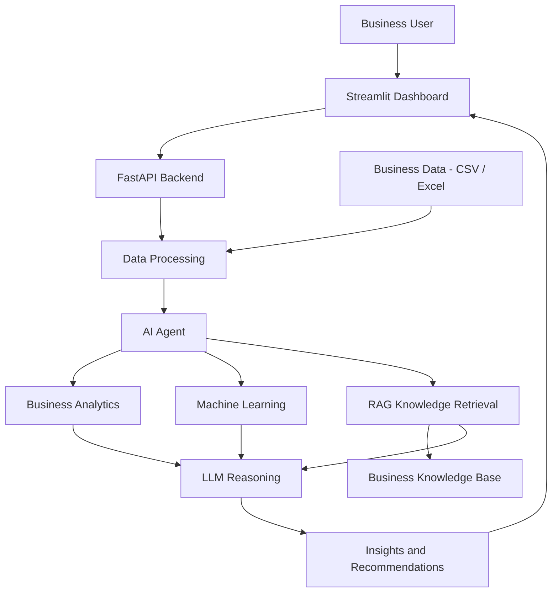

<div align="center">

# 🚀 AI Business Intelligence & Decision Support Assistant

### **Turning Business Data into Intelligent Decisions**

[](#)
[](#)
[](#)
[](#)
[](#)
[](#)

</div>

---

> **Codenixia AI/ML Industry Internship Technical Selection Challenge — 2026**  
> **Candidate:** Apurva Adhav

---

## 🌐 Executive Problem & Solution Overview

### Problem

Business teams generate large amounts of sales, customer, inventory, and operational data, but extracting meaningful insights from this data often requires manual analysis.
Traditional Business Intelligence tools primarily explain what happened. Determining why it happened and what action should be taken can still require significant analytical effort.

### Proposed Solution Overview

The **AI Business Intelligence & Decision Support Assistant** is an AI-powered platform that enables users to analyze business data through natural-language queries and generate actionable insights using **Data Analytics, Machine Learning, LLMs, RAG, and Agentic AI**.
Users can upload CSV/Excel datasets, ask business questions, and receive data-driven insights, visualizations, and recommendations.

The system is designed to bridge the gap between traditional Business Intelligence and AI-driven decision support.

---

## 💡 Features

1. **Business Data Analysis** — Analyze sales, customers, products, inventory, and performance.
2. **Natural Language Queries** — Interact with business data using conversational questions.
3. **Agentic AI** — Dynamically select analytical tools based on the user's query.
4. **Machine Learning** — Support anomaly detection, trend analysis, and predictive analytics.
5. **RAG** — Retrieve relevant business policies, rules, and documentation.
6. **Visual Analytics** — Generate charts and performance insights.
7. **Decision Support** — Convert analytical results into actionable recommendations.
8. **REST API** — Provide backend services through FastAPI.

---

## 🔄 System Workflow

```text
                    ┌──────────────────┐
                    │  Business User   │
                    └────────┬─────────┘
                             ↓
                    ┌──────────────────┐
                    │ CSV / Excel Data │
                    └────────┬─────────┘
                             ↓
                    ┌──────────────────┐
                    │ Data Processing  │
                    └────────┬─────────┘
                             ↓
                    ┌──────────────────┐
                    │ Natural Language │
                    │      Query       │
                    └────────┬─────────┘
                             ↓
                    ┌──────────────────┐
                    │    AI Agent      │
                    └────────┬─────────┘
                             ↓
              ┌──────────────┼──────────────┐
              ↓              ↓              ↓
       Data Analysis      ML Tools       RAG
              └──────────────┼──────────────┘
                             ↓
                    ┌──────────────────┐
                    │       LLM        │
                    │ Insight Generation│
                    └────────┬─────────┘
                             ↓
                    ┌──────────────────┐
                    │    Insights &    │
                    │ Recommendations  │
                    └──────────────────┘
```
---

## 🏗️ System Architecture

The system follows a modular architecture integrating **business data processing, analytics, Machine Learning, RAG, Agentic AI, and LLM-based reasoning**.



### Architecture Flow

**Business User → Streamlit Dashboard → FastAPI → Data Processing → AI Agent → Analytics / ML / RAG → LLM → Decision Support**

The architecture separates data processing, analytical operations, knowledge retrieval, and AI reasoning to support structured and data-driven business decision-making.

---

## 🤖 Agentic AI & Tool Calling

The system goes beyond a simple **Question → LLM → Answer** approach.

The AI Agent determines which tools and analysis are required to answer a business question.

```text
User Query
    ↓
AI Agent
    ↓
Tool Selection
    ↓
Data / ML / RAG Operations
    ↓
Analysis
    ↓
LLM
    ↓
Business Insight
```

### Example Tools

```text
analyze_sales()
analyze_customers()
analyze_inventory()
detect_anomalies()
predict_sales()
generate_chart()
retrieve_business_policy()
```

---

## 📊 RAG Integration

The RAG layer provides access to relevant business knowledge such as:

* Business policies
* Pricing guidelines
* Sales procedures
* Inventory rules
* Operational documentation

This allows recommendations to be informed by both **business data and domain knowledge**.

---

## 🛠️ Technology Stack

| Category                | Technologies                     |
| ----------------------- | -------------------------------- |
| **Programming**         | Python                           |
| **Data Analytics**      | Pandas, NumPy                    |
| **Machine Learning**    | Scikit-learn                     |
| **Generative AI**       | LLM                              |
| **Knowledge Retrieval** | RAG, Embeddings, Vector Database |
| **Agentic AI**          | AI Agent, Tool Calling           |
| **Backend**             | FastAPI                          |
| **Dashboard**           | Streamlit                        |
| **Deployment**          | Docker                           |
| **Version Control**     | Git, GitHub                      |

---

## 💼 Business Use Case

**Example Query:**
> *"Why did sales decrease this month and what should we do?"*

The system can identify:
**Sales Trends → Key Contributors → Anomalies → Relevant Business Knowledge → Recommended Actions**

This helps transform raw business data into interpretable insights and actionable decisions.

---

## 🎯 Objective

To build a unified AI-driven Business Intelligence platform that connects:

**Business Data + Analytics + ML + LLM + RAG + Agentic AI** 
to support faster and more informed business decision-making.

---

## 🚀 Getting Started

```bash
git clone <repository-url>
cd AI-Business-Intelligence-Assistant

python -m venv .venv
.venv\Scripts\activate

pip install -r requirements.txt
```

### Run Backend

```bash
uvicorn app.main:app --reload
```

### Run Dashboard

```bash
streamlit run dashboard/app.py
```

---

## 👤 Author

**Apurva Adhav**

*B.Tech — Artificial Intelligence & Machine Learning*

---

### ⭐ AI-Powered Analytics for Smarter Business Decisions
